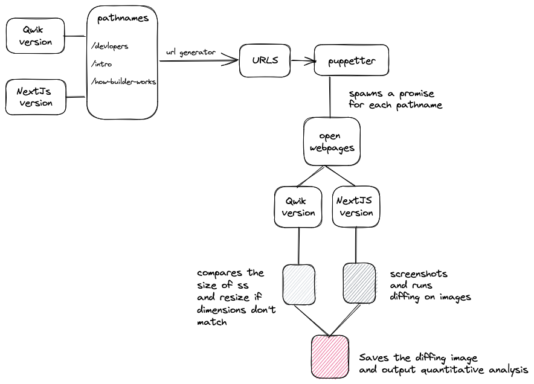
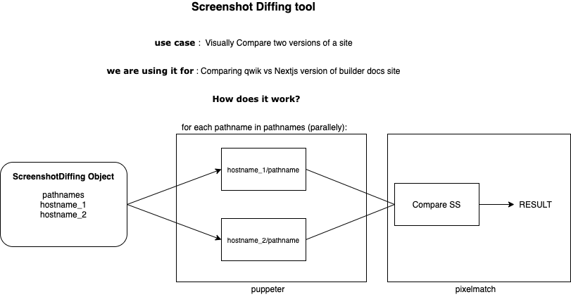

<h2 align="center">SSDiff</h2>
<h4 align="center">The open-source tool for pixel-perfect website migrations<h4>


### Features
<ul>
   <li> Outputs a folder showing visual differences comparing images </li>
   <li>Out of the box feature to compare different sized screenshots by resizing them</li>
   <li> Debug logging and output logging can be enabled by config </li>
   <li> Configurable for multiple use cases </li>
   <li> Helps in determining the most different pathnames by providing a sorted result map as output</li>
</ul>

### Use Cases: 
<ul>
   <li> Compare screenshots to achieve a pixel-perfect match </li>
   <li> Ideal for website migrations to a new stack </li>
   <li> Spot differences in similar-looking web pages </li>
   <li> Open-source and customizable </li>
</ul>

### Installation
```
npm install ssdiff
```
### Config 
```js
    export interface SSDiffConfig {
      url1: string; // url of domain1
      url2: string; // url of domain2
      pathnames: string[]; // array of pathnames to be compared
      browserConfig?: BrowserConfig; // config passed to puppeteer.launch
      screenshotConfig?: ScreenshotConfig; // config passed to page.screenshot
      pageConfig?: PageConfig; // config passed to page.goto
      failInCaseOfDifferentSize?: boolean; // if true, the comparison will fail if the images are of different sizes
      debug?: boolean; // if true, debug logs will be printed
      outputFile?: boolean; // if true, output logs will be printed
      waitUntil?: string; // when the screenshot should be taken in regards to the loaded state of the page, defaults to networkidle0
    }

```

### Dependencies
1. The tool uses [puppeteer](https://github.com/puppeteer/puppeteer/tree/main) to open browser in headless mode visit pages and take screenshots. 
2. It uses [pixelmatch](https://github.com/mapbox/pixelmatch) to compare the screenshots and return a result map.
3. It uses [sharp](https://www.npmjs.com/package/sharp) to resize the screenshots, in case they are of different sizes.

### Local setup
1. Clone the repo
2. ```npm install```
3. ```npm run dev``` - to run ts scripts with runtime build using ts-node
4. Modify and test example based on the changes made in src/ folder.

### Contribution guide
1. Create an issue or assign yourself an existing one
2. Fork the repo
3. ```git checkout -b branch_name```
4. Make the changes
5. run linting and formatting scripts
6. Make a PR and associate it with the issue

### Example usage

An example can be found [here](https://github.com/akshatgarg12/SSDiff/tree/main/example)


### Example Flow


### Basic architecture of the tool


