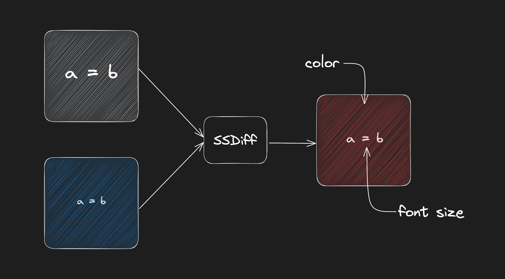

<h2  align="center">SSDiff</h2>

<h4  align="center">The open-source tool for pixel-perfect website migrations<h4>

  


  

### Use Cases:

  

<ul>

<li> Compare two URLs to achieve a pixel-perfect match </li>

<li> Ideal for website migrations to a new stack </li>

<li> Spot differences in similar-looking web pages </li>

<li> Open-source and customizable </li>

<li> Perform diffing in realtime without any hassle</li>

</ul>

  

### Installation

If you want to run websites (automated) on a browser based environment and get PNG diffs for multiple paths and URLs use,

```
npm install ssdiff
```

#### Vite plugin
If you want to do the visual testing yourself on your browser by just adding `?diff=true` command, use our vite plugin. This will show you the output directly and compare it with two base URLs that you provide.

```
npm install vite-plugin-realtime-diff
```


```js
// vite.config.ts
import { realtimeDiff } from 'vite-plugin-realtime-diff'

export  default  defineConfig(() => {
	return {
		plugins: [realtimeDiff('https://builder.io/')],
	}
})
```
